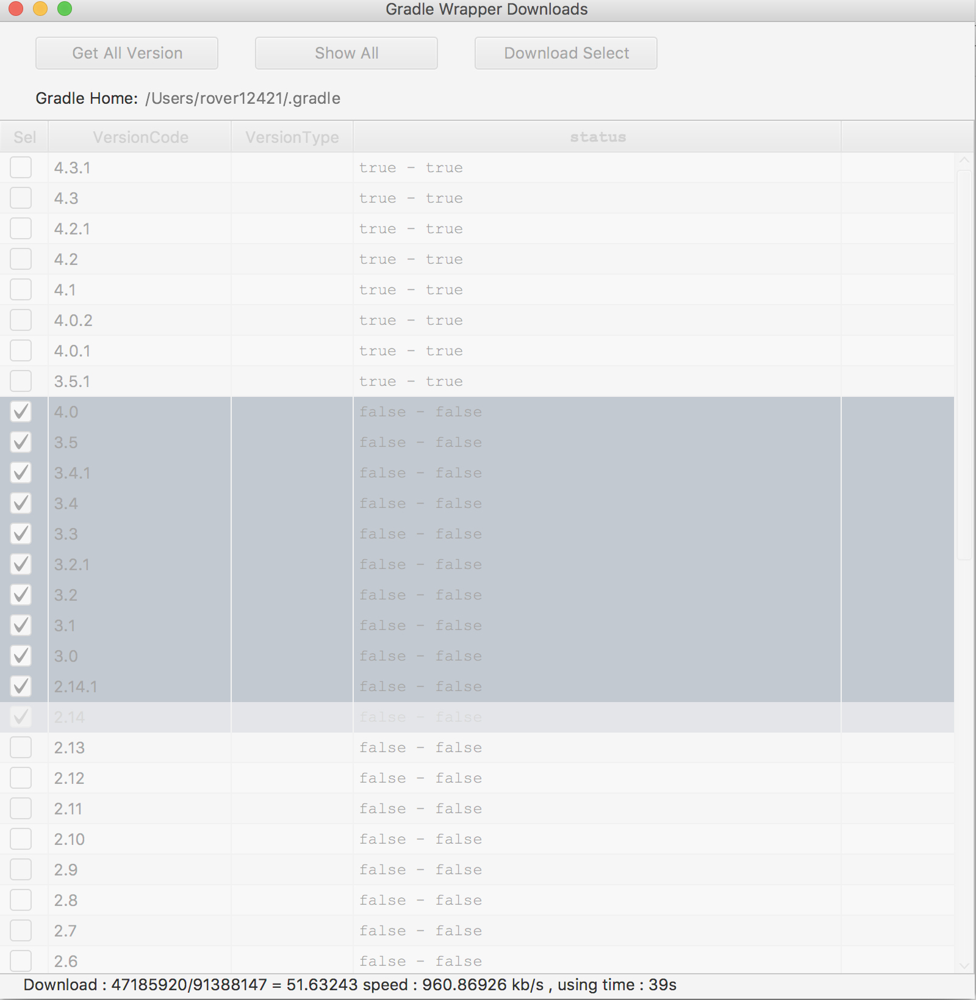
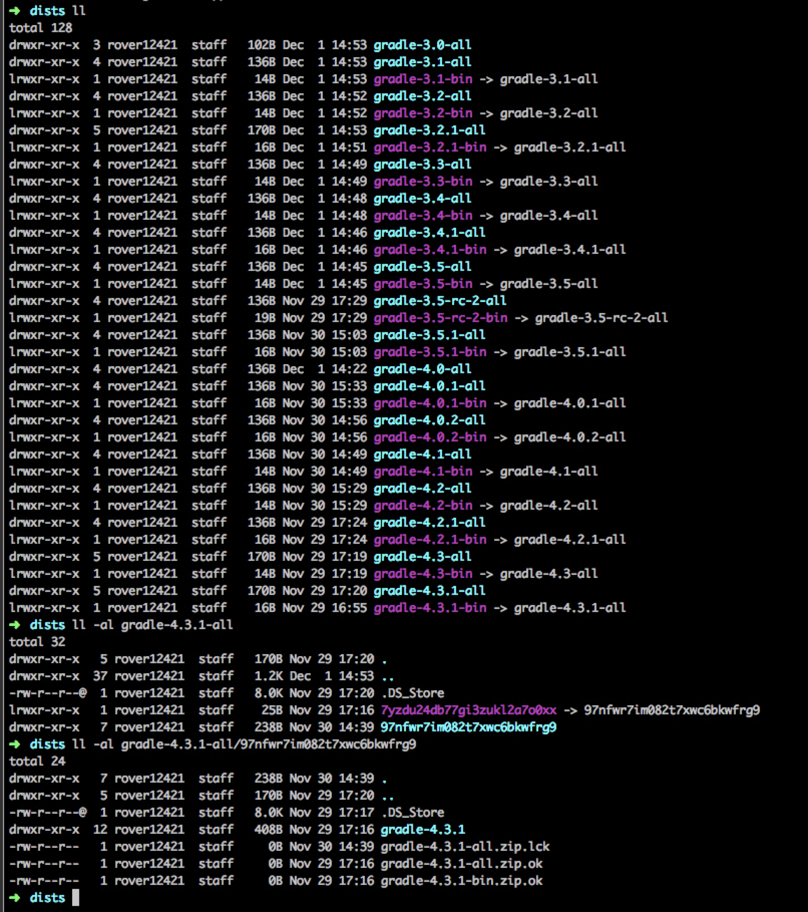

# Gradle Wrapper Download

多线程断点续传下载 Gradle wrapper 文件

下载到默认目录：`~/.gradle/wrapper/dists`

**仅支持 Linux/Mac**

只下载 `all` 版本。 `bin` 版本使用 `ln` 创建相应的软连接，减少磁盘占用, 也因为如此，暂时不支持 `Windows`

没有显示下载进度，同一时间只下载一个文件。

测试国内不用代理，多线程下载的速度也是可以的。

代码写的烂，欢迎整理，修复，增加新功能

`status` 表示 `all` - `bin` 是否都是ok的

